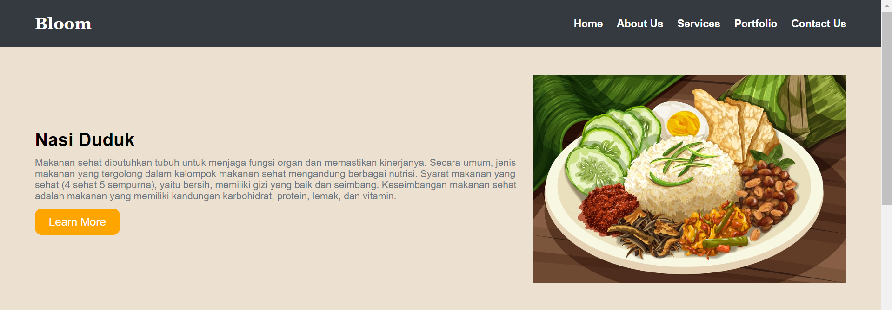

# Layout Bloom #

Tugas membuat layout Bloom ini seru dan menantang! Di sini, kamu akan merancang tampilan yang menarik dan fungsional untuk aplikasi atau website Bloom. Layout ini harus mempertimbangkan aspek visual seperti warna, font, dan penempatan elemen agar tampak estetis. Selain itu, penting juga untuk memastikan navigasi yang mudah agar pengguna bisa mengakses informasi dengan cepat. Dengan menggunakan HTML dan CSS, kamu bisa menciptakan desain yang responsif dan nyaman dilihat, cocok banget untuk menarik perhatian pengguna!